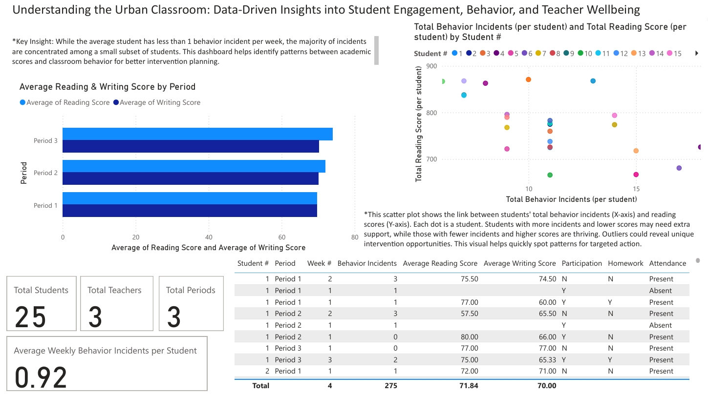

# Urban Classroom Power BI Dashboard

This project demonstrates how simulated classroom data can be visualized and analyzed using Power BI to uncover insights on student engagement, behavior, academic performance, and teacher wellbeing.  
**Note:** All data is simulated—no real student or staff information is included.

## Dashboard Screenshot

## About the Project

- Visualizes student behavior incidents, academic scores, and classroom trends
- Identifies at-risk students and supports data-driven intervention planning
- Example dashboard for education analytics and data storytelling

## Files

- `Urban_Classroom_Analytics.pbix` — Power BI file
- `Urban_School_Simulated_Data.xlsx` — Simulated classroom data
- `Screenshot_26-4-2025_11051_.jpeg` — Dashboard screenshot
- `README.md`

## How to Use

1. Download the `.pbix` and `.xlsx` files.
2. Open the Power BI file and connect it to the data source if needed.
3. Explore the dashboard visuals and experiment with the data.

## Disclaimer

This project uses fully simulated data for demonstration and learning purposes only.

---

Feedback and suggestions are welcome!
