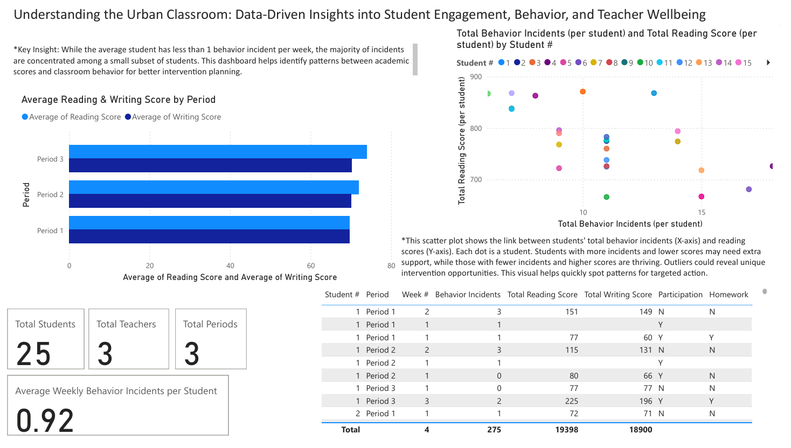

# Urban Classroom Power BI Dashboard

This project analyzes student engagement, behavior, and teacher wellbeing in a simulated urban classroom using Power BI.

## Key Features
- Visualizes reading & writing scores by period
- Highlights behavior incidents per student
- Identifies at-risk students for targeted intervention

## Key Insights
- Most students average less than 1 behavior incident per week
- Majority of incidents concentrated among a few students
- Data-driven insights support targeted support strategies

## Tools Used
- Power BI Desktop

## Contact
Questions or feedback? Connect with me on [LinkedIn](your-link-here)!
